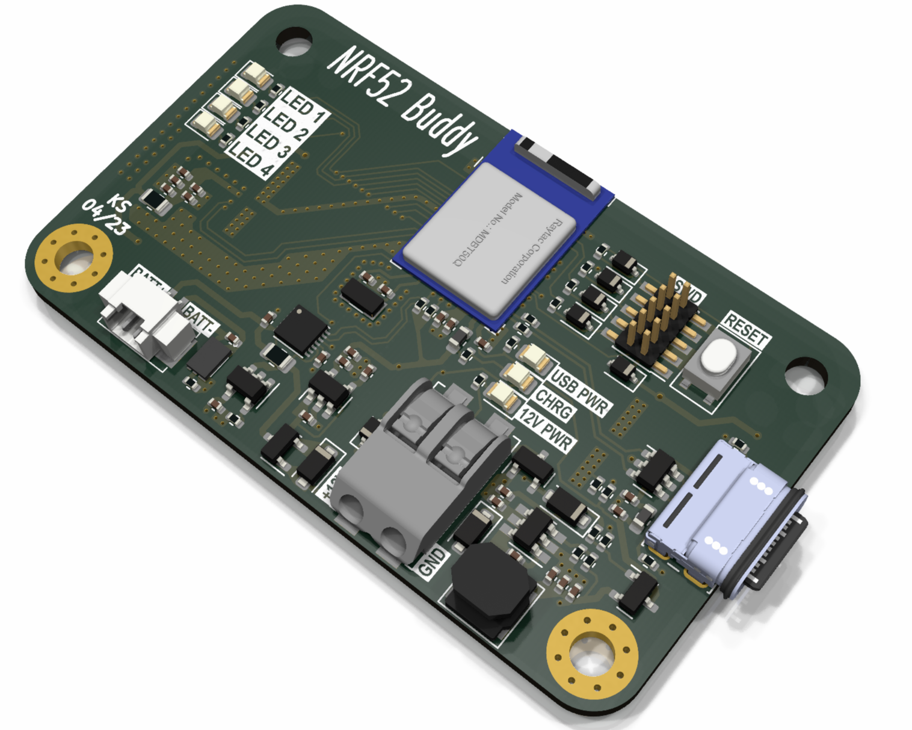

# nRF52Buddy-Hardware
This repository contains the hardware files for nRF52 Buddy board

## Overview

The nRF52 Buddy System on Module (SoM) is a powerful tool for fast prototyping of new BLE-connected products. It features the MDBT50Q Bluetooth module containing a nRF52840 microcontroller, multiple power input options, battery management and monitoring, and two 52-pin mezzanine connectors for daughter board integration. The board is designed using KiCad 7.0 and can be modified to suit your needs.

## Features

* MDBT50Q Bluetooth module with nRF52840 microcontroller
* USB-C, 12V, and battery power input options
* Battery management for undervoltage, overvoltage, and charging
* Battery monitoring with the MAX17260 chipset
* Two 52-pin mezzanine connectors for daughter board integration
* Designed using KiCad 7.0

## Getting Started

The board is designed using KiCad 7.0 and can be modified to suit your needs.

## Power Input Options

The nRF52 Buddy PCB design has three possible sources of power input:

1. USB-C - You can connect the board to a USB-C port for power.
2. 12V - You can connect the board to a 12V power source.
3. Battery - You can connect a battery to the board for power.

## Battery Management

The nRF52 Buddy PCB design features battery management for undervoltage, overvoltage, and charging. This ensures that the battery is protected from damage and extends its life. The MAX17260 chipset is used for battery monitoring.

## Mezzanine Connectors

The nRF52 Buddy PCB design has two 52-pin mezzanine connectors for integrating with daughter boards. This makes it easy to add additional functionality to your project.

